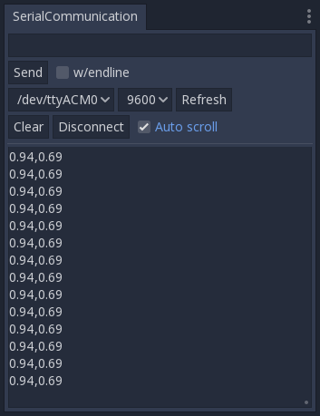

# GDSerCommPlugin
A Godot plugin to read Arduino serial input

# Dependencies
* https://github.com/ingeniamc/sercomm
* https://github.com/GodotNativeTools/godot_headers
* https://github.com/Superwaitsum/GDSercomm

# Installation
## Build binaries
### Windows 10 64-bit
* In Powershell run these commands
```
git clone --depth=1 git@github.com:Superwaitsum/GDSercomm.git
cd .\GDSercomm\
git clone --depth=1 git@github.com:GodotNativeTools/godot_headers.git
git clone --depth=1 git@github.com:ingeniamc/sercomm.git
cd .\sercomm\
cmake -S. -Bbuild
cmake --build build
cd ..
cp .\sercomm\build\config.h .\sercomm\include\public\sercomm\
mkdir lib
cp .\sercomm\build\Debug\sercomm.lib .\lib\
cp .\sercomm\build\Debug\sercomm.dll .\lib\
scons p=platform
cp .\lib\sercomm.lib .\bin\
```
* Now you should have all your .dll in the GDSercomm/bin folder

### Ubuntu 18.04
* In terminal run these commands
```
git clone --depth=1 git@github.com:Superwaitsum/GDSercomm.git
cd GDSercomm/
git clone --depth=1 git@github.com:GodotNativeTools/godot_headers.git
git clone --depth=1 git@github.com:ingeniamc/sercomm.git
cd sercomm/
cmake -H. -Bbuild
cmake --build build
cd ..
cp sercomm/build/config.h sercomm/include/public/sercomm/
mkdir lib
cp sercomm/build/libsercomm.so lib/
scons p=platform
cp lib/libsercomm.so bin/
cp bin/libsercomm.so /usr/lib
ldconfig
```
* Now you should have all your .so in the GDSercomm/bin folder

## Plugin

* Git clone repo into your addons folder in the root of your project.
* Inside the editor got to Project->Projects Settings->Plugins and activate "Serial Communication"

# Screenshot


