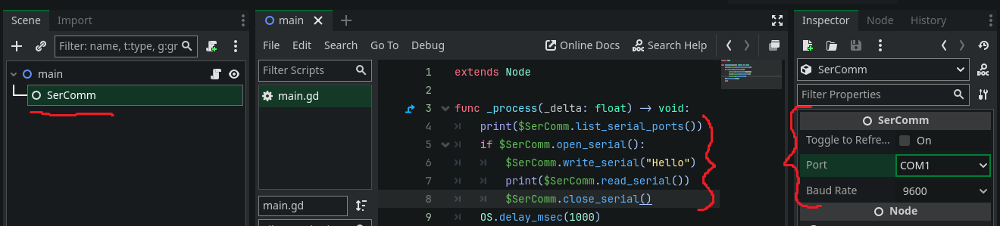

# SerCommPlugin
A Godot 4.1+ plugin to read/write Arduino serial input.\
Read
[GDExtension](https://docs.godotengine.org/en/stable/tutorials/scripting/gdextension/index.html)
for more

# Dependencies
* [Godot 4.1 or above](https://github.com/godotengine/godot/releases/tag/4.1.3-stable)
* [godot-cpp](https://github.com/godotengine/godot-cpp)
* [libserialport](https://github.com/sigrokproject/libserialport) (LGPL-3.0 license)
    * MSBuild v143 or later for Windows builds
    * '```apt install autoconf libtool```' for Linux
* [fmt](https://github.com/fmtlib/fmt) (./src/fmt/) (MIT license)

# Build system
* [SCons](https://scons.org/)
* [Python 3.10 or above](https://www.python.org/downloads/)
* Python virtual environment
* [Git](https://git-scm.com/)

## Compilation Database and/or CMake
 **Experimental feature**\
The Scons build will generate a Compilation Database (CD). CLion can open a CD directly\
You can also run the generate_cmake.py script to generate a CMakeLists.txt.
```
mkdir build
cd build
cmake .. 
make
```

# Repo structure
    src - Plugin source code
    deps - Dependencies, like libserialport. Will be created on install\
    godot-cpp - Godot bindings. Will be created on install\

# Full Build
This will build everything form scratch
```
python -m venv ./pvenv

// Activate pvenv for Windows
pvenv\Scripts\activate
// Activate pvenv for Unix/MacOS
source pvenv/bin/activate

pip install -r requirements.txt
python install.py
```

# Quick Build
This will only build the GDSercomm part. Requires at least on Full Build before working
```
python -m venv ./pvenv

// Activate pvenv for Windows
pvenv\Scripts\activate
// Activate pvenv for Unix/MacOS
source pvenv/bin/activate

pip install -r requirements.txt
python build.py
```

# Output
After a completed build all files you need will be in ./demo/bin directory.
Except the libserialport library. It will be inside the ./deps/libserialport directory.
```
Windows = .\deps\libserialport\x64\Debug\libserialport.dll
Linux = libserialport.so
```

# Usage
1. Create a SerComm node in your scene.
2. Select baudrate and port number.
3. Create a script on any other node in scene
4. script your logic


By toggle the radio button the extension will search for available ports and refresh the port dropdown list.

Create a SerComm node for each port you want to read or write to.
